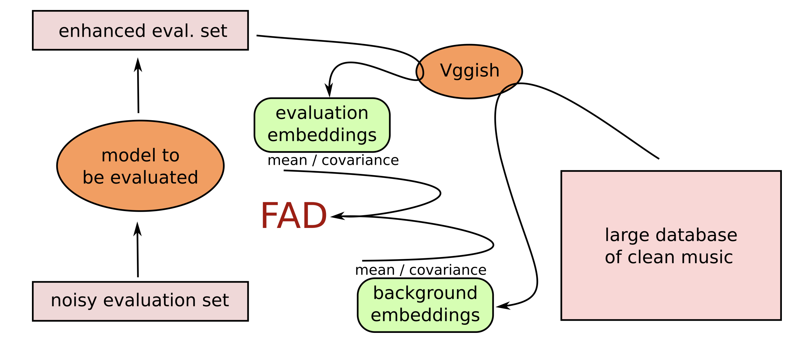

# Musical Audio Generation

## Goal of the Task

Musical audio generation aims to create various musical content, from individual notes {cite}`DBLP:conf/iclr/EngelACGDR19` to instrumental accompaniments/arrangements {cite}`DBLP:journals/corr/abs-2406-08384` and complete songs {cite}`DBLP:conf/icml/EvansCTHP24`. 
In the early days of audio generation research, methods often focused on producing audio directly in the time or time-frequency domain. 
Recent approaches, however, work with compressed representations, often using neural audio codecs.

The most widely used models today are autoregressive (Transformer) architectures and diffusion models. Autoregressive architectures are particularly effective for discrete codecs, while diffusion models are better suited for continuous representations.

## Popular Datasets

- **NSynth**: NSynth was once the go-to dataset for musical audio generation and can be regarded the "MNIST" in audio. It contains short, synthetic, single-note samples from different instrument families and detailed metadata, making it a valuable resource for early experiments.

- **GTZAN**: The GTZAN dataset is often used for genre classification and can serve as a starting point for more complex audio generation tasks involving diverse genres.

- **MusicNet**: Contains recordings of classical music with aligned annotations, suitable for tasks involving complex musical structures.

- **MAESTRO**: The MAESTRO dataset features piano performances, providing MIDI and corresponding audio recordings. This makes it particularly useful for training models of high-quality piano music generation.

- **MagnaTagATune**: Offers a large collection of music with tags, useful for genre classification and multi-label tasks.

## How is the Task Evaluated?

Evaluation of generation tasks is difficult. In other ML tasks, specific targets (e.g., labels, data points) are available in a given evaluation set, allowing precision estimation for a given model. In contrast, in audio generation, the goal is to sample from the distribution of the training set without directly reproducing any training data.

As a result, indirect, distribution-based evaluation metrics are commonly used rather than relying on one-to-one comparisons, as in autoencoders or classification tasks.

### Frechet Audio Distance (FAD)

Nowadays, the most commonly used metric in assessing the quality of generated audio is the Frechet Audio Distance (FAD) {cite}`DBLP:conf/interspeech/KilgourZRS19`. 
It compares the statistics of generated audio to those of real, high-quality reference samples in the embedding space of a pre-trained model.
The idea is to assess the "closeness" of the two distributions: one for the generated samples and one for real samples.

#### Origins and Motivation

**Figure 1:** FAD computation overview for a music enhancement system as initially proposed (image source: {cite}`DBLP:conf/interspeech/KilgourZRS19`).

Fréchet Audio Distance was initially developed to evaluate music enhancement algorithms (see Figure 1). 
It filled a gap in objective audio quality evaluation, especially in generative tasks like music synthesis, audio inpainting, and speech generation. 
Before FAD, audio evaluations often relied on metrics like mean squared error (for reconstruction-based approaches) or subjective listening tests. 
While subjective tests remain essential for evaluating the perceptual quality of audio, FAD offers a more automated, quantifiable approach that aligns with perceptual quality.

#### Calculation of FAD

The FAD metric works by embedding audio signals into a perceptual feature space using a pre-trained deep neural network model.
Initially a VGGish model was proposed, but it has been shown that LAION CLAP embeddings {cite}`DBLP:conf/icassp/WuCZHBD23` or a specific PANN model {cite}`DBLP:journals/taslp/KongCIWWP20` align better with perceived audio quality {cite}`DBLP:conf/icassp/GuiGBE24, DBLP:journals/corr/abs-2403-17508`.
Once embedded, it treats these embeddings as multidimensional distributions and calculates the Fréchet Distance (also known as the Wasserstein-2 distance) between the two distributions.

Mathematically, it involves comparing the means and covariances of these distributions:

$$
\text{FAD} = \| \mu_r - \mu_g \|^2 + \text{Tr}( \Sigma_r + \Sigma_g - 2 (\Sigma_r \Sigma_g)^{1/2} )
$$

where $\mu_r$ and $\Sigma_r$ are the mean and covariance of the reference (real) distribution, and $\mu_g$ and $\Sigma_g$ are those of the generated distribution.

#### Applications of FAD

FAD is widely used in research on generative audio models, including:

1. **Music and Sound Generation**: Evaluating GANs or VAEs that generate music, sound effects, or synthetic soundscapes.
2. **Speech Synthesis**: Benchmarking TTS (Text-to-Speech) systems to gauge how close generated speech is to natural human voices.
3. **Audio Super-Resolution**: Comparing high-resolution generated audio with real high-resolution samples.
4. **Denoising and Enhancement**: Assessing the quality of denoised or enhanced audio by comparing it to clean reference audio.

Since its introduction, FAD has become a standard metric for evaluating the realism and quality of generated or processed audio.

Certainly! Here’s a compact explanation of the **Inception Score (IS)** and **Kernel Inception Distance (KID)**, based on typical usage in evaluating generative models:

### Inception Methods
The following methods apply if class labels are available for the training data of a generative model.
They rely on a so-called *Inception network* -- a classifier trained to predict the class labels from the data.

#### Inception Score (IS)

The **Inception Score** is a metric that evaluates the quality and diversity of generated samples by measuring two key properties:
(1) **high confidence** in classifications (suggesting realistic, distinct samples) and
(2) **diversity** across classes (indicating a wide variety of generated outputs). 

It uses a pre-trained Inception network to classify generated samples and calculates the score as follows:

$$
\text{IS} = \exp \left( \mathbb{E}_x \left[ D_{\text{KL}}( p(y|x) \| p(y) ) \right] \right)
$$

In this formula:
- $ p(y|x) $ represents the conditional class distribution given a generated sample $ x $, where higher confidence corresponds to more realistic samples.
- $ p(y) $ is the marginal class distribution across samples, promoting diversity if samples cover a wide range of classes.
- The **Kullback-Leibler divergence** $ D_{\text{KL}} $ between $ p(y|x) $ and $ p(y) $ is averaged over all generated samples, capturing the balance between realism and diversity. The exponential of this average yields the final Inception Score, with higher values indicating better quality.

IS is commonly applied in image generation but can be adapted for use in generative audio and other domains.

#### Kernel Inception Distance (KID)

**Kernel Inception Distance (KID)** is a metric that evaluates the similarity between real and generated samples. Unlike IS, which only uses generated samples, KID compares the distributions of real and generated data using features extracted by a pre-trained Inception network. KID is calculated by computing the **squared Maximum Mean Discrepancy (MMD)** between the embeddings of real and generated samples, with a polynomial kernel for smoothing:

$$
\text{KID} = \| \mathbb{E}[\phi(x_r)] - \mathbb{E}[\phi(x_g)] \|^2
$$

Here:
- $\phi(x_r)$ and $\phi(x_g)$ represent the feature embeddings of real and generated samples, respectively.
- MMD measures the difference in means of these embeddings, with KID summing the squared differences to capture distributional similarity.

Unlike FAD, which uses covariance matrices, KID operates without assumptions about distribution shape and generally provides unbiased estimates, especially in small sample sizes. Lower KID values suggest that generated samples closely match the distribution of real samples, making it suitable for generative tasks requiring high-quality and realistic outputs.

### Subjective Evaluation

Objective evaluation metrics cannot capture all the details people care about when listening to audio. 
Therefore, it is very common (and important) in audio generation works to perform user studies where human listeners assess the perceived quality of audio, focusing on aspects like naturalness, clarity, and overall fidelity.
For completeness, we also include methods in this section that are used to compare the audio quality of two or more audio files, typically used in audio enhancement, super resolution or restoration. 

For reliable results in all methods, it is crucial to conduct tests in controlled listening environments, ideally with high-quality audio equipment. 
Statistical analysis (like t-test) is often applied afterward to ensure the results are significant and unbiased.

#### Without Reference Samples

The following metrics are used in cases where an absolute reference isn’t available, which typically applies to musical audio generation.

One of the most widely used methods is the **Mean Opinion Score (MOS)**, where listeners rate each audio sample on a numerical scale, typically from 1 to 5 (i.e., Likert Scale), with higher scores indicating better quality. 
MOS is popular because it gives a straightforward average score for quality, often applied in areas like audio generation, speech synthesis and audio enhancement.

**Single Stimulus Rating (SSR)** allows listeners to rate each sample individually. 
This method is helpful when comparing samples of widely differing qualities, such as generated audio, without needing a reference sample.

**Attribute-Specific Rating (ASR)** asks listeners to rate audio on specific qualities, like brightness, clarity, or naturalness, giving a more nuanced evaluation across multiple dimensions. 
This approach is particularly useful when certain attributes are especially important, like naturalness in speech synthesis.

#### With Reference Samples

In **Comparison Category Rating (CCR)**, listeners are presented with two audio samples, often a high-quality reference and a processed version, and rate the difference in quality between them. 
This method helps detect subtle quality changes by making a direct comparison, which is useful for assessing codecs and noise reduction techniques.

For more precise distinctions, **ABX Testing** is a go-to approach. 
In this test, listeners hear three samples—two known (A and B) and one unknown (X) that matches either A or B. 
They must identify which one X corresponds to, revealing subtle perceptual differences. 
ABX tests are commonly used to test the transparency of audio processing techniques.

Another evaluation approach is the **Degradation Category Rating (DCR)**, which involves rating the perceived degradation of an audio sample relative to a high-quality reference. 
Listeners rate how much the quality has deteriorated, ranging from “imperceptible” to “very annoying,” making DCR effective in testing the negative impacts of audio processing and compression methods.

In the **MUSHRA (MUltiple Stimuli with Hidden Reference and Anchor)** test, listeners rate multiple versions of the same audio on a scale from 0 to 100, with both high-quality and low-quality references included. 
MUSHRA provides detailed insight across various conditions, making it useful for codec testing and audio enhancement evaluations.