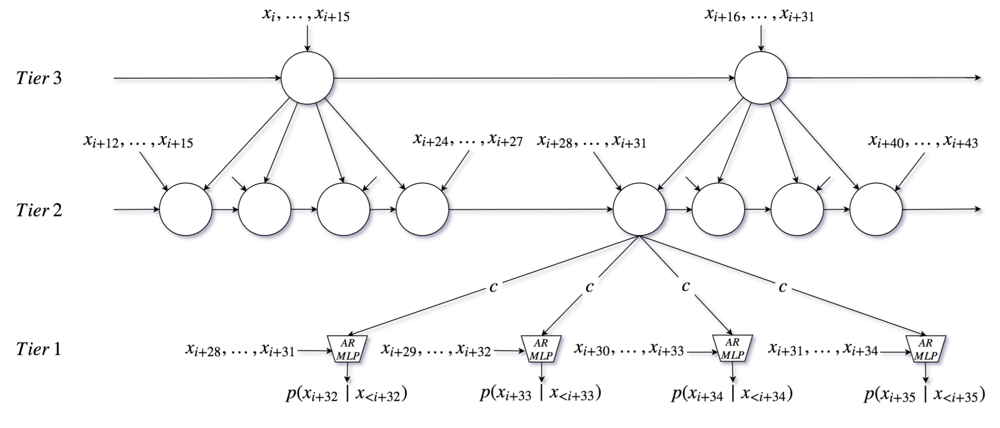

# Musical Audio Generation

## Goal of the Task

Musical audio generation aims to create a wide range of musical content, from individual notes to full instrumental arrangements and complete songs. In the early days of audio generation research, methods often focused on producing audio directly in the time or time-frequency domain. Recent approaches, however, work with compressed representations, often using neural audio codecs.

The most widely used models today are autoregressive (Transformer) architectures and diffusion models. Autoregressive architectures are particularly effective for discrete codecs, while diffusion models are better suited for continuous representations.

## Popular Datasets

- **NSynth**: NSynth was once the go-to dataset for musical audio generation. It contains short, synthetic, single-note samples from different instrument families, along with detailed metadata, making it a valuable resource for early experiments.

- **GTZAN**: The GTZAN dataset is often used for genre classification and can serve as a starting point for more complex audio generation tasks involving diverse genres.

- **MAESTRO**: The MAESTRO dataset features piano performances, providing both MIDI and corresponding audio recordings. This makes it particularly useful for training models focused on high-quality piano music generation.

## Neural Musical Audio Synthesis

### Early Works

Before the rise of Transformers and diffusion models, models like Causal Convolutional Networks (CCNs, WaveNet), Recurrent Neural Networks (RNNs) and Generative Adversarial Networks (GANs) were used for musical audio generation.
At the time, it was common to generate in a low-level representation space, either directly in the signal domain (WaveNet, SampleRNN) or in the spectral domain (GANs).
Not least due to the generation in such a high-dimensional space CNNs/RNNs struggled with long-term dependencies, leading to repetitive or incoherent results without higher-level structure.  
GANs were used to generate audio in the signal or frequency domain but faced challenges with training instability and producing high-quality, diverse outputs.
Through usage of neural audio codecs and the resulting reduction in dimensionality, the problem became simpler.
Nowadays, through combination of more efficient/simpler to train generative models with generation in a compressed space, it is possible to generate high-quality full-length music tracks.

#### WaveNet

**Figure 1:** WaveNet architecture showing causal, dilated convolutions.

WaveNet {cite}`DBLP:conf/ssw/OordDZSVGKSK16` can be seen as the first successful attempt to directly generate audio using a Neural Network.
Important components in WaveNet were dilated convolutions {cite}`DBLP:journals/corr/YuK15` that enabled an exponentially growing receptive field with linearly increasing numbers of layers.
A big receptive field was critical in WaveNet, because it worked directly in the signal domain with 16k samples/second.
In addition, causal convolutions were used in order to prevent the model from looking into the future during training resulting in a generative autoregressive sequence model.

Autoregressive sequence models are typically trained with cross entropy loss that requires one-hot encoded sequences.
As raw audio is usually 16 bit, a naive transformation into one-hot vectors would result in 65,536 dimensions per time step.
To keep the problem tractable, in WaveNet each sample is non-linearly scaled and quantized to obtain 256-dimensional vectors as

$$
f(x_t) = \text{sign}(x_t) \frac{\ln(1 + \mu |x_t|)}{\ln(1 + \mu)}
$$

**Figure 2:** Non-linear scaling of audio samples in WaveNet for $\mu = 255$ (in practice, $-1 < x_t < 1$).

#### SampleRNN

**Figure 3:** Snapshot of the unrolled model at timestep $i$ with 3 tiers. As a simplification only one RNN and up-sampling ratio $r = 4$ is used for all tiers.

SampleRNN {cite}`DBLP:conf/iclr/MehriKGKJSCB17` was the first RNN-based neural audio synthesizer that had an impact in the community.
It can effectively learn to generate long-form audio at a sample rate of 16kHz.
While **WaveNet** builds hierarchical representations of audio by its built-in sub-sampling though dilated convolutional layers, 
SampleRNN builds such a hierarchy through multiple tiers of RNNs that operate in different "clock rates".
This approach enables representations at varying temporal resolutions, where lower tiers (faster rates) are conditioned on higher tiers. 
This encourages higher tiers to generate higher-level signal representations that help predict lower-level details.

Similarly to WaveNet, in order to keep the task tractable, the sample values are quantized to 256 bins -- but without prior, non-linear scaling.

#### Generative Adversarial Networks

For nearly a decade, Generative Adversarial Networks (GANs) {cite}`DBLP:journals/corr/GoodfellowPMXWOCB14` dominated the field of generative models.
Their ability to implicitly model multi-dimensional *continuous-valued* distributions made them a compelling tool for image and audio generation.
In audio generation, this enabled the use of *spectrogram (or spectrogram-like) representations* which is a natural modality for 2d convolutional networks.
Another motivation to use image-like spectrogram representations with GANs for audio generation was not least the ability to leverage insights from the broader image processing community. 

**Figure 3:** GANSynth rainbowgrams to showcase the influence of different audio representations.

While WaveGAN {cite}`DBLP:conf/iclr/DonahueMP19` was an influental work on using GANs directly for raw musical audio waveform generation, most works focussed on spectrogram-like representations.
Examples for that are GANSynth {cite}`DBLP:conf/iclr/EngelACGDR19`, SpecGAN {cite}`DBLP:conf/iclr/DonahueMP19`, DrumGAN {cite}`DBLP:conf/ismir/NistalLR20, DBLP:journals/corr/abs-2206-14723`, and DarkGAN {cite}`DBLP:conf/ismir/NistalLR21`, omitting those only applied to speech.
For simplicity reasons, the listed works are able to generate fixed-size outputs only. Some (later) examples of variable-size musical audio generation using GANs are VQCPC-GAN {cite}`DBLP:conf/waspaa/NistalALR21` and Musica! {cite}`DBLP:conf/ismir/PasiniS22`.    

At present, GANs are widely replaced by Diffusion Models which are more stable in training, less prone to mode-collapse and have a simpler architecture which together results in higher-quality outputs.  
A concept of GANs that could remain in the mid-term is the gradient inversion of auxiliary networks, for example for domain confusion or as additional loss in reconstruction-based training (sometimes denoted as "perceptual loss" in current neural audio codecs {cite}`DBLP:conf/nips/KumarSLKK23`). 

### Autoregressive (Transformer) Architectures

Autoregressive models, especially those based on Transformers, are well-suited for generating sequences like musical audio. These models generate audio by predicting each subsequent token based on prior ones, capturing long-term relationships effectively, which helps in producing coherent compositions.

### Diffusion Models

Diffusion models offer another approach to musical audio generation. They transform random noise into meaningful continuous audio representations.

## How is the Task Evaluated?

Evaluation of generation tasks is difficult. In other ML tasks, specific targets (e.g., labels, data points) are available in a given evaluation set, allowing for the estimation of precision for a given model. In contrast, in audio generation, the goal is to sample from the distribution of the training set, without directly reproducing any training data.

As a result, indirect, distribution-based evaluation metrics are commonly used, rather than relying on one-to-one comparisons like in autoencoders or classification tasks.

### Frechet Audio Distance (FAD)

Nowadays, the most commonly used metric in audio generation is the Frechet Audio Distance (FAD). FAD compares the statistics of generated audio to those of real audio using embeddings from a pre-trained model. This metric provides a measure of how close the generated audio is to the original data distribution, which helps in assessing the quality and diversity of generated samples.

### Subjective Evaluation

Objective evaluation metrics cannot capture all details people care about when listening to audio. Therefore, it is very common (and important) in works on audio generation to perform user studies. 

Lickert Scale
