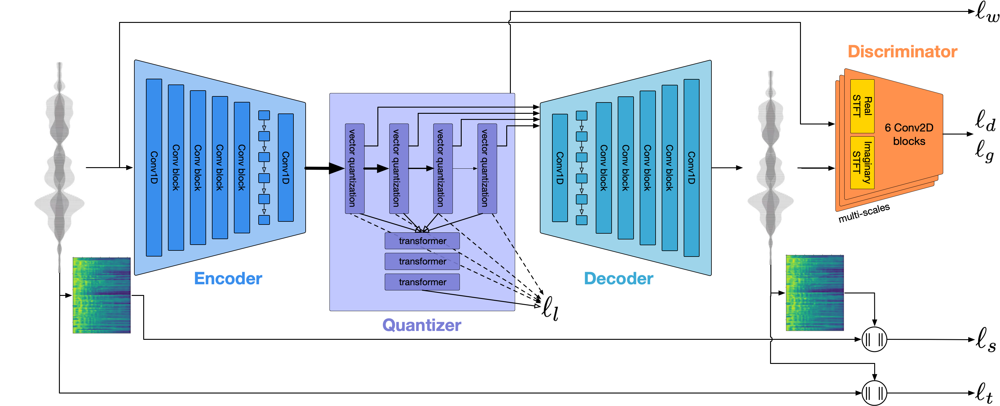

# Autoregressive Generation

In this tutorial, we demonstrate a practical implementation of musical audio generation using an autoregressive Transformer model and discrete audio representations obtained from a neural audio codec. We focus on the guitar subset of the NSynth dataset and use EnCodec representations to train our model.

## EnCodec Neural Audio Codec

[EnCodec](https://github.com/facebookresearch/encodec) {cite}`DBLP:journals/tmlr/DefossezCSA23` is a neural audio codec that compresses audio signals into discrete latent codes, achieving high compression rates while maintaining audio quality. It encodes audio into a sequence of discrete tokens using quantized latent vectors from multiple codebooks. This transforms the continuous audio generation problem into a discrete sequence modeling task, suitable for autoregressive models like Transformers.



**Figure 1**: Overview of the EnCodec architecture and training. The input audio is encoded into discrete tokens using residual vector quantization (image source: {cite}`DBLP:journals/tmlr/DefossezCSA23`).

To use EnCodec for our task, we first encode our dataset into discrete token sequences.

```python
!pip install encodec

from encodec import EncodecModel
from encodec.utils import convert_audio

# Load the EnCodec model
codec = EncodecModel.encodec_model_24khz()
codec.set_target_bandwidth(1.5)  # Set target bandwidth in kbps
LEVELS = 2 # 2 for bandwidth 1.5

# Function to encode audio into discrete tokens (schematic from DiscreteAudioRepDataset)
def encode_audio(waveform, sample_rate):
    # Add batch dimension
    waveform = torch.tensor(waveform, dtype=torch.float32).unsqueeze(0)
    waveform = convert_audio(waveform, sample_rate, codec.sample_rate, codec.channels)
    with torch.no_grad():
        encoded_frames = codec.encode(waveform)
    
    # we linearize the codebook
    codes = encoded_frames[0][0].contiguous().permute(0, 2, 1).reshape(-1)
    return codes.flatten()
```

## Preparing the Dataset

We use the guitar subset of the NSynth dataset, encoding each audio file into discrete token sequences by initializing the `DiscreteAudioRepDataset` and the `DataLoader`.

```python
# Download the NSynth guitar dataset
!git clone https://github.com/SonyCSLParis/test-lfs.git
!bash ./test-lfs/download.sh NSYNTH_GUITAR_MP3

# Load the NSYNTH dataset and prepare DataLoader for training and validation.
audio_folder_train = "./NSYNTH_GUITAR_MP3/nsynth-guitar-train"
audio_folder_val = "./NSYNTH_GUITAR_MP3/nsynth-guitar-valid"

dataset = DiscreteAudioRepDataset(root_dir=audio_folder_train, encoder=codec,
                                  lazy_encode=False, max_samples=-1)

dataset_val = DiscreteAudioRepDataset(root_dir=audio_folder_val, encoder=codec,
                                      lazy_encode=False, max_samples=-1)

# Create Dataloaders for training and validation.
dataloader = DataLoader(dataset, batch_size=125, shuffle=True)
dataloader_val = DataLoader(dataset_val, batch_size=125, shuffle=True)
```

---
(lab_architecture_auto)=
## Transformer Model Architecture

We use a classic Transformer decoder with *rotary positional embeddings* from x_transformers to model the sequence of discrete tokens autoregressively.

The model predicts the next token given the previous tokens.

```python
from x_transformers import TransformerWrapper, Decoder

model = TransformerWrapper(
    num_tokens=1024,  # Vocabulary size from EnCodec
    max_seq_len=250,  # Maximum sequence length
    attn_layers=Decoder(
        dim=256,
        depth=6,
        heads=4,
        rotary_pos_emb=True
    )
)
```

---

## Training and Inference

### Training Objective

The model is trained to minimize the **cross-entropy loss** between the predicted token distribution and the true next token in the sequence:

$$
\mathcal{L} = -\sum_{t} \log P(y_t^* \mid y_{<t})
$$

where $y_t^*$ is the true token at time $t$, and $y_{<t}$ are the previous tokens.

### Training Loop

We train the model using teacher forcing, where the true previous tokens are provided as input during training.

```python
import torch.nn as nn

criterion = nn.CrossEntropyLoss()
optimizer = torch.optim.Adam(model.parameters(), lr=1e-4)

for epoch in range(num_epochs):
    for batch in dataloader:
        start_tokens = torch.zeros((batch.shape[0], 1))
        batch = torch.cat([start_tokens, batch], dim=1)

        logits = model(batch)
        logits = logits.permute(0, 2, 1)
        
        inputs = logits[..., :-1]  # All tokens except the last
        targets = batch[..., 1:]  # All tokens except the first
        
        loss = criterion(inputs, targets)
        loss.backward()
        optimizer.step()
        optimizer.zero_grad()
```

### Inference and Generation

During inference, we generate new sequences by sampling tokens one at a time from the model's output distribution.

```python
    LEVELS = 2 # 2 for bandwidth 1.5
    generated = [start_token]
    model.eval()
    for _ in range(seq_length):
        input_seq = torch.tensor([generated]).long()
        logits = model(input_seq)[:, -1, :]
        probs = torch.softmax(logits, dim=-1)
        next_token = torch.multinomial(probs, num_samples=1).item()
        generated.append(next_token)
    
    generated_sequence = torch.tensor(generated[1:]) # Remove start_token
    codes = generated_sequence.view(1, -1, LEVELS).transpose(1, 2) # reshape to de-linearlize (into sequences of 2 Levels)

    # Decode into waveform
    decoded_audio = codec.decode([(codes, None)])
```

---

## Conclusion

In this tutorial, we demonstrated a simple implementation of musical audio generation using an autoregressive Transformer model and EnCodec representations. 
By encoding audio data into discrete token sequences, we transformed the audio generation problem into a sequence modeling task suitable for training with cross-entropy loss and sampling from a multinomial distribution.

**Key Points**:

- **Neural Audio Codec (EnCodec)**: Compresses audio into discrete tokens, enabling training using cross-entropy loss and sampling from a discrete distribution.
- **Autoregressive Transformer**: Models the probability distribution of the next token given previous tokens.
- **Training with Cross-Entropy Loss**: Trains the model to predict the next token in the sequence.
- **Sequence Generation**: Generates new audio samples by sampling tokens from the model.

This approach leverages the strengths of both neural audio codecs and autoregressive sequence models, enabling efficient audio generation in a compressed latent space.