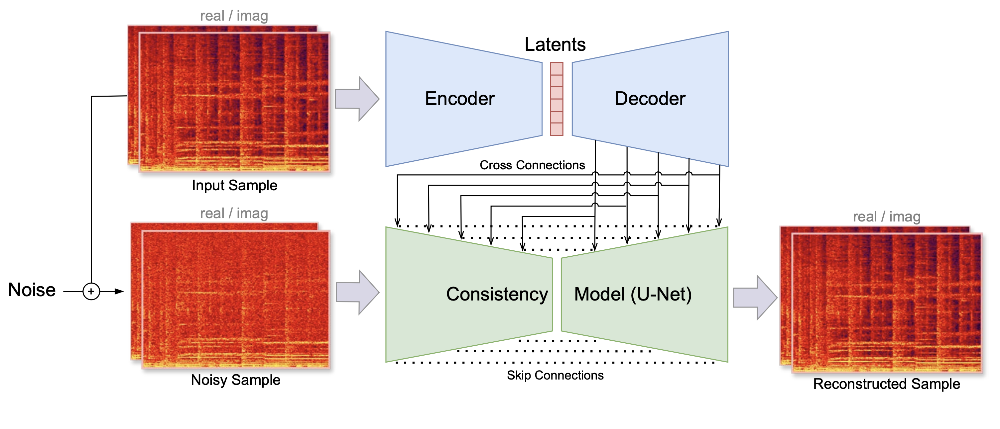

# Generation with Latent Diffusion

For non-autoregressive generation, Latent Diffusion is currently one of the most effective and popular approaches.
It focuses on creating high-quality samples by modeling data in a compressed, latent space rather than the spectrogram or waveform level. 
This approach reduces computational cost and time by generating compact latent representations that, compared to raw data, are already simplified and organized.

Here, we provide a simple example of musical audio generation using the guitar subset of the NSynth dataset, Music2Latent representations, and a classic U-Net architecture.
In the corresponding [notebook](https://github.com/geoffroypeeters/deeplearning-101-audiomir_notebook/blob/master/TUTO_task_Generation_Diffusion.ipynb) we implement a diffusion model that adopts a **Rectified Flow** method with **ODE-based sampling**. 
This approach combines elements from both **denoising diffusion probabilistic models (DDPMs)** and **normalizing flows**, resulting in a continuous-time framework for generative modeling.


## Music2Latent Codec
Music2Latent (M2L) {cite}`DBLP:journals/corr/abs-2408-06500` provides highly compressed, continuous audio representations with ~$11 \times 64$-dimensional vectors per second (for 44.1kHz sample rate).
A consistency autoencoder facilitates a *generative decoder* that makes up for potentially lost information, enabling high-quality reconstructions.



**Figure 1**: Training process of Music2Latent. The input sample is first encoded into a sequence of latent vectors. 
The latents are then upsampled with a decoder model.
The consistency model is trained via consistency training, conditioned on the information coming from the cross connections.

In our example, we first transform the dataset into M2L representations on which we then train our diffusion model.
This involves the following steps:

  ``` python
  !pip install music2latent
  
  import soundfile as sf
  from music2latent import EncoderDecoder
  
  # Initialize the encoder/decoder
  encdec = EncoderDecoder()
  
  # Load the audio file using soundfile
  waveform, _ = sf.read("sample.wav")
  
  # Encode using music2latent
  latent = EncoderDecoder().encode(waveform)
  ```

## Preparing the dataset

In the following code, we download the dataset, intitialize the `MusicLatentDataset` and the `DataLoader`: 
  ``` python
  # Download the dataset using git-lfs
  !git clone https://github.com/SonyCSLParis/test-lfs.git
  !bash ./test-lfs/download.sh NSYNTH_GUITAR_MP3
  
  # Initialize the dataset and dataloader
  audio_folder_train = "./NSYNTH_GUITAR_MP3/nsynth-guitar-train"
  audio_folder_val = "./NSYNTH_GUITAR_MP3/nsynth-guitar-valid"
  
  # When initializing the dataset, the data gets compressed using the M2L encoder
  dataset = MusicLatentDataset(root_dir=audio_folder_train, encoder=encdec)
  dataset_val = MusicLatentDataset(root_dir=audio_folder_val, encoder=encdec)
  
  dataloader = DataLoader(dataset, batch_size=500, shuffle=True)
  dataloader_val = DataLoader(dataset_val, batch_size=500, shuffle=False)
  ```

---

## **Diffusion Model Architecture**

The `DiffusionUnet` class defines a [classic U-Net architecture](lab_unet) with time conditioning. 
The time embedding (`self.time_mlp`) is a multi-layer perceptron (MLP) that embeds the time variable $t$ into a higher-dimensional space to condition the model on the diffusion time step.
It is added to the deepest layer, allowing the model to adjust its predictions based on the amount of noise present.

   ```python
   def forward(self, x, t):
       # ...
       
       # Bottleneck
       h = self.bottleneck(h)

       # Time embedding
       t_emb = self.time_mlp(t.unsqueeze(-1))  # [batch_size, channels]
       t_emb = t_emb.unsqueeze(-1)             # [batch_size, channels, 1]
       h = h + t_emb                           # Broadcast addition
       # ... 
   ```

---

## **Training and Inference**

In this section, we show the 

1. **Noise Addition via Linear Interpolation**: The model adds noise to the data by linearly interpolating between the clean data $\mathbf{x}_0$ and pure noise $\mathbf{z}$, controlled by a time variable $t$ as

   $$
   \mathbf{x}_t = (1 - t) \mathbf{x}_0 + t \cdot \mathbf{z}, \quad t \in [0, 1],
   $$

   where $t$ is the time step indicating the level of noise added, with $t = 0$ being no noise and $t = 1$ being full noise.
   This formulation is commonly used in Rectified Flow models and allows a simple, linear interpolation between the data and pure noise.

2. **Training Objective**: The model is trained to predict the residual $\mathbf{v} = \mathbf{x}_t - \mathbf{z}$ from the noisy samples and the time $t$. This residual guides the denoising process.
   In the case of Rectified Flow with ODE-based sampling, the reverse process can be formulated as:

   $$
   \frac{d\mathbf{x}}{dt} = f(\mathbf{x}_t, t),
   $$

   where $f(\mathbf{x}_t, t)$ is the learned denoising function that predicts the residual (difference between noisy data and clean data):

   $$
   f(\mathbf{x}_t, t) \approx \mathbf{x}_t - \mathbf{z}.
   $$

   As the model is trained to learn the difference between the data and the *unscaled* noise, it effectively learns a vector field with vectors pointing towards positions of high density (high probability).

3. **ODE-Based Sampling**: During inference, the model uses an Ordinary Differential Equation (ODE) solver (the trained U-Net) to integrate over time from $t = 1$ (pure noise) to $t = 0$ (clean data).
   As the model outputs unscaled direction vectors, at inference they are scaled by $\Delta t = \frac{1}{\text{num_steps}}$ (the `step_size`).
   Note that, given the initial noise $\mathbf{z}$, this process is deterministic.
   This is in contrast to Denoising Diffusion Probabilistic Models (DDPMs) based on Stochastic Differential Equations (SDEs), where the noise is sampled at every step of the reverse diffusion process.


### **Noise Addition and Training Objective**

The `RectifiedFlows` class handles the noise addition and defines the training loss:

- **Noise Addition (`add_noise` method)**:

  ```python
  def add_noise(self, x, noise, times):
      return (1. - times) * x + times * noise
  ```

  `add_noise` performs a linear interpolation between clean data `x` and random noise `noise` based on the time variable `times`.

- **Time Variable Sampling**:

  ```python
  times = torch.nn.functional.sigmoid(
      torch.randn(y.shape[0]) * self.P_std + self.P_mean
  )
  ```

  The sigmoid non-linearity ensures `times` lies between 0 and 1.

- **Training Objective (`forward` method)**:

  ```python
  def forward(self, model, x, sigma=None, return_loss=True, **model_kwargs):
      # ...
      noises = torch.randn_like(y)
      v = x - noises
      noisy_samples = self.add_noise(y, noises, times)
      fv = model(noisy_samples, times, **model_kwargs)
      loss = mse(v, fv)
      # ...
  ```
The model calculates the residual by subtracting the noise from the data, expressed as $v = x - \text{noise}$. 
It then predicts $fv$, an approximation of the residual $v$, based on the noisy samples and the corresponding time step. 
The loss function used is the Mean Squared Error (MSE) between the true residual $v$ and the predicted residual $fv$, which is given by $\text{Loss} = \| v - \text{fv} \|^2$. 
Predicting the residual instead of the noise or the data directly is a characteristic of the **Rectified Flow** method, while in **Denoising Diffusion Probabilistic Models (DDPMs)**, the model typically predicts the noise. 

### **3. Inference and Sampling Process (`inference` function)**

During inference, the model generates new samples by solving an ODE:

```python
def inference(rectified_flows, net, latents_shape, num_steps):
    # Initialize with pure noise
    current_sample = torch.randn(latents_shape)
    times = torch.ones(latents_shape[0])
    step_size = 1 / num_steps
    # Integrate over time
    for i in range(num_steps):
        v = net(current_sample, times)
        current_sample = current_sample + step_size * v
        times = times - step_size
    return current_sample / sigma_data
```

- **Initialization**:

  - **`current_sample`**: Starts as pure noise.
  
  - **`times`**: Begins at $t = 1$, representing the highest noise level.

- **Integration Loop**:

  - **Time Step (`step_size`)**: Calculated as $\Delta t = \frac{1}{\text{num_steps}}$.

  - **Euler's Method**: Updates the sample by moving in the direction of `v` predicted by the model:

    $
    \text{current_sample} = \text{current_sample} + \Delta t \cdot v
    $

  - **Time Update**: $t = t - \Delta t$

- **Result**: After integrating from $t = 1$ to $t = 0$, the `current_sample` approximates a sample from the data distribution.


---

## **Conclusion**

In this tutorial, we demonstrated a practical implementation of musical audio generation using Latent Diffusion with the guitar subset of the NSynth dataset and Music2Latent (M2L) representations. 
By encoding audio data into compressed latent vectors through M2L, we significantly reduced computational complexity.

We employed a diffusion model that adopts the **Rectified Flow** method with **ODE-based deterministic sampling**. 
This approach merges concepts from both denoising diffusion probabilistic models (DDPMs) and normalizing flows into a continuous-time generative modeling framework. 

Specifically, the model:

- **Trains to predict residuals** between the data and noise, effectively learning a vector field pointing toward regions of high data density. This residual prediction guides the denoising process during generation.

- **Utilizes ODE-based deterministic sampling** during inference, integrating over time from pure noise ($t = 1$) to clean data ($t = 0$) without introducing additional randomness at each step. This results in a more efficient and stable generation process compared to stochastic methods.

- **Incorporates a time-conditioned U-Net architecture** that adapts its predictions based on the noise level at each time step. The time embedding allows the model to handle varying noise levels.