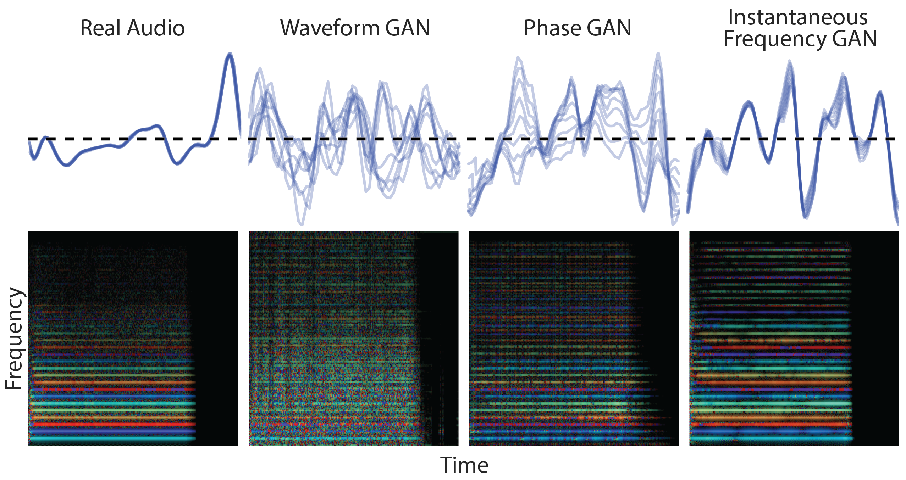

# Early Works

Before the rise of Transformers and Diffusion Models, models like Causal Convolutional Networks, Recurrent Neural Networks (RNNs), and Generative Adversarial Networks (GANs) were used for musical audio generation.
At the time, it was common to generate in a low-level representation space, either directly in the signal domain (WaveNet, SampleRNN) or in the spectral domain (GANs).
Not least, due to their generation in such a high-dimensional space, CNNs/RNNs struggled with long-term dependencies, leading to repetitive or incoherent results without higher-level structure.  
GANs were used to generate audio in the signal or frequency domain but faced challenges with training instability and producing high-quality, diverse outputs.
Through the usage of neural audio codecs and the resulting reduction in dimensionality, the problem became simpler.
Nowadays, through a combination of more efficient/simpler to-train generative models with generation in a compressed space, it is possible to generate high-quality, full-length music tracks.

(lab_wavenet)=
## WaveNet


**Figure 1:** WaveNet architecture showing causal, dilated convolutions (image source: {cite}`DBLP:conf/ssw/OordDZSVGKSK16`).

WaveNet {cite}`DBLP:conf/ssw/OordDZSVGKSK16` can be seen as the first successful attempt to directly generate audio using a Neural Network.
Important components in WaveNet are dilated convolutions {cite}`DBLP:journals/corr/YuK15` that enable an exponentially growing receptive field with linearly increasing numbers of layers.
A big receptive field is critical in WaveNet because it operates directly in the signal domain with 16k samples/second.
In addition, causal convolutions are used to prevent the model from looking into the future during training, resulting in a generative autoregressive sequence model.

Autoregressive sequence models are typically trained with cross-entropy loss that requires one-hot encoded sequences.
As raw audio is usually 16-bit, a naive transformation into one-hot vectors would result in 65,536 dimensions per time step.
To keep the problem tractable, in WaveNet, each sample is non-linearly scaled and quantized to obtain 256-dimensional vectors.
The non-linear scaling function (ITU-T, 1988) is defined as

$$
f(x_t) = \text{sign}(x_t) \frac{\ln(1 + \mu |x_t|)}{\ln(1 + \mu)}.
$$


```{figure} ./images/wavenet_non-linearity.png
---
width: 80%
name: wavenet_scaling
---
```
**Figure 2:** Non-linear scaling of audio samples in WaveNet for $\mu = 255$ (in practice, $-1 < x_t < 1$).

*Usage Example*: WaveNet was used by Google for text-to-speech (TTS) applications.

(lab_samplernn)=
## SampleRNN


**Figure 3:** Snapshot of the unrolled SampleRNN model at timestep $i$ with 3 tiers. As a simplification, only one RNN and up-sampling ratio $r = 4$ is used for all tiers (image source: {cite}`DBLP:conf/iclr/MehriKGKJSCB17`).

SampleRNN {cite}`DBLP:conf/iclr/MehriKGKJSCB17` was the first RNN-based neural audio synthesizer that had an impact in the community.
It can effectively learn to generate long-form audio at a sample rate of 16kHz.
While **WaveNet** builds hierarchical representations of audio by its built-in sub-sampling through dilated convolutional layers, 
SampleRNN builds such a hierarchy through multiple tiers of RNNs that operate in different "clock rates".
This approach enables representations at varying temporal resolutions, where lower tiers (faster rates) are conditioned on higher tiers. 
This encourages higher tiers to generate higher-level signal representations that help predict lower-level details.

Similarly to WaveNet, in order to keep the task tractable, the sample values are quantized to 256 bins—but without prior, non-linear scaling.
As the memory of RNNs can be updated iteratively without the need to reconsider past inputs, they tend to need less compute at inference time than non-recurrent autoregressive models (like causal convolutions or transformers).

*Usage Example*: Different artists used SampleRNN for music generation. Notably, a [livestream](https://www.youtube.com/watch?v=JF2p0Hlg_5U&ab_channel=DADABOTS) (by Dadabots) with Technical Death Metal music is ongoing with hardly any interruptions since March 2019 {cite}`DBLP:journals/corr/abs-1811-06633`.       

(lab_gans2)=
## Generative Adversarial Networks

For several years, Generative Adversarial Networks (GANs) {cite}`DBLP:journals/corr/GoodfellowPMXWOCB14` were among the most influential generative models.
Their ability to implicitly model multi-dimensional *continuous-valued* distributions made them a compelling tool for image and audio generation.
This enabled the use of spectrogram (or spectrogram-like) representations in audio generation, which is a natural modality for 2D convolutional networks.
Another motivation for using image-like spectrogram representations with GANs for audio generation was the ability to leverage insights from the broader image-processing community. 



**Figure 4:** GANSynth rainbowgrams to showcase the influence of different audio representations (image source: {cite}`DBLP:conf/iclr/EngelACGDR19`).

While WaveGAN {cite}`DBLP:conf/iclr/DonahueMP19` was an influential work on using GANs directly for raw musical audio waveform generation, most works focussed on spectrogram-like representations.
Examples for that are GANSynth {cite}`DBLP:conf/iclr/EngelACGDR19`, SpecGAN {cite}`DBLP:conf/iclr/DonahueMP19`, DrumGAN {cite}`DBLP:conf/ismir/NistalLR20, DBLP:journals/corr/abs-2206-14723`, and DarkGAN {cite}`DBLP:conf/ismir/NistalLR21`, omitting those only applied to speech.
For simplicity reasons, the listed works can generate fixed-size outputs only. Some (later) examples of variable-size musical audio generation using GANs are VQCPC-GAN {cite}`DBLP:conf/waspaa/NistalALR21` and Musica! {cite}`DBLP:conf/ismir/PasiniS22`.    

Presently, GANs are widely replaced by Diffusion Models, which are more stable in training, less prone to mode-collapse, and have a simpler architecture, resulting in higher-quality outputs.  
A concept of GANs that could remain in the mid-term is the usage of adversarial losses from auxiliary networks, for example, for domain confusion or as additional loss in reconstruction-based training (e.g., in neural audio codecs, like DAC {cite}`DBLP:conf/nips/KumarSLKK23`). 

*Usage Example*: DrumGAN was the first commercially available neural audio synthesizer for music integrated into [Steinberg's Backbone](https://www.steinberg.net/vst-instruments/backbone/). It is now available for free as an [online app](https://drumgan.csl.sony.fr/).